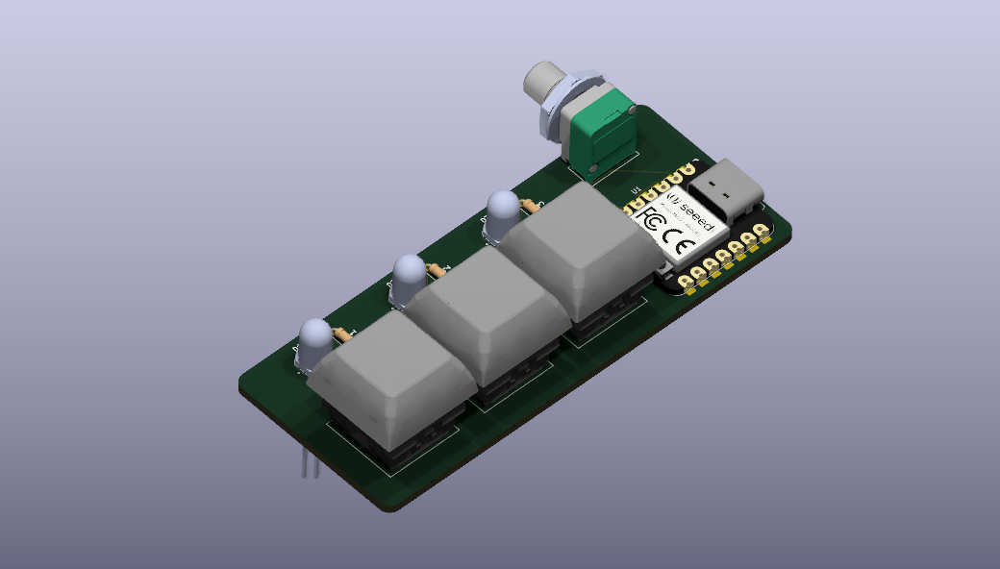

# pathfinder
Stasis starter project, now moved to Forge. Simple efidget PCB. This technically isn't my first PCB I've made, but all the past ones I've made were made with no guidance, so they were sort of terrible. I made this one from the tutorial that Hackclub provides, with some of my own modifications, like repositioning some components as well as adding a potentiometer to control the brightness of the LEDs.

